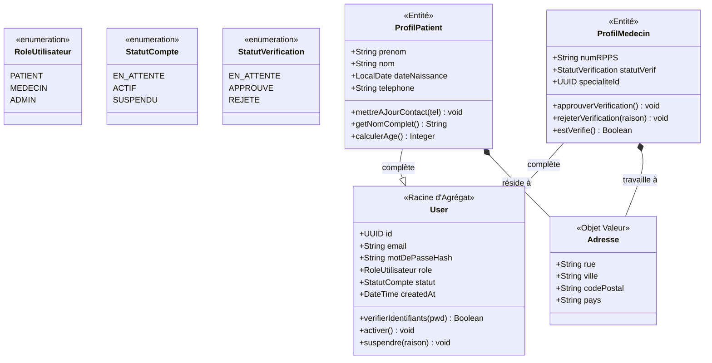

# MediLink - Workflow de Conception

> **Projet :** MediLink — Application de mise en relation entre patients et médecins pour la prise de rendez-vous en ligne, la gestion des créneaux et le partage sécurisé de documents médicaux.

---

## Table des matières

1. [Étape 1 — Liste brute des fonctionnalités](#étape-1--liste-brute-des-fonctionnalités)
2. [Étape 2 — Regroupement par domaine métier (DDD)](#étape-2--regroupement-par-domaine-métier-ddd)
3. [Étape 3 — Entités métier par module](#étape-3--entités-métier-par-module)

---

## Étape 1 — Liste brute des fonctionnalités

> **Méthode :** Liste exhaustive, non triée. Mode « fonctionnel pur » — *ce que* fait l'application, pas *comment* elle est construite. Trois perspectives : Patient, Médecin, et Administrateur système.

### 👤 Patient

- Créer un compte
- Se connecter
- Modifier son profil
- Rechercher un médecin par spécialité, ville ou nom
- Consulter les créneaux disponibles
- Prendre rendez-vous
- Annuler ou déplacer un rendez-vous
- Recevoir des rappels par notification ou email
- Consulter l'historique des rendez-vous
- Déposer des documents médicaux
- Consulter des ordonnances ou comptes rendus
- Laisser un avis sur le praticien

### 🏪 Médecin

- Créer un compte professionnel
- Renseigner sa spécialité
- Définir ses horaires de consultation
- Ouvrir ou fermer des créneaux
- Consulter son agenda
- Accepter ou refuser certaines demandes
- Consulter le dossier administratif du patient
- Déposer une ordonnance
- Déposer un compte rendu
- Suivre l'historique des rendez-vous

### 🛡️ Perspective Administrateur Système

- Gérer les comptes utilisateurs
- Vérifier les comptes médecins
- Modérer les avis
- Superviser la plateforme
- Gérer les catégories de spécialités médicales
- Consulter des statistiques globales

---

## Étape 2 — Regroupement par domaine métier (DDD)

> **Principe appliqué :** Forte cohésion au sein de chaque module (toutes les fonctionnalités partagent la même raison métier d'évoluer), faible couplage entre les modules (chaque module expose des interfaces propres et ne dépend pas des détails internes d'un autre).

Six **Contextes Bornés** (Bounded Contexts) émergent naturellement :

| # | Module / Contexte Borné | Responsabilité principale | Raison clé de la séparation |
|---|---|---|---|
| 1 | **Identity & Access** | Qui êtes-vous ? Authentification, création de comptes (patient/médecin) et validation des diplômes | La sécurité et le processus de vérification des praticiens sont critiques et isolés |
| 2 | **Medical Directory** | Qu'est-ce qui est disponible ? Recherche, spécialités et profils publics des médecins | La logique de recherche (filtres, villes) évolue différemment de la prise de rendez-vous |
| 3 | **Appointment** | Quand se voit-on ? Gestion des créneaux, réservations, annulations et reports | C'est le cœur du métier avec des règles de collision et de disponibilité complexes |
| 4 | **Health Record** | Quels sont les faits ? Stockage sécurisé des ordonnances, comptes rendus et documents patients | La gestion des fichiers (PDF) et la confidentialité médicale exigent une infrastructure spécifique |
| 5 | **Notification** | Comment informer ? Rappels automatiques, alertes de report et emails de confirmation | Ce module est souvent asynchrone (Event-Driven) pour ne pas bloquer le reste de l'app |
| 6 | **Administration** | Comment va la plateforme ? Modération des avis et statistiques de fréquentation | Les outils d'analyse et de modération sont destinés aux administrateurs, pas aux utilisateurs |

### Carte des dépendances entre modules

```
                  ┌───────────────────────┐
                  │   Identity & Access   │
                  └───────────┬───────────┘
                              │ (Token JWT / Rôle : Patient, Médecin, Admin)
          ┌───────────────────┼───────────────────┐
          ▼                   ▼                   ▼
  ┌───────────────┐   ┌───────────────┐   ┌──────────────┐
  │   Directory   │   │  Appointment  │   │ Governance   │
  └───────┬───────┘   └───────┬───────┘   └──────────────┘
          │                   │
          │ (ID Praticien)    │ (Événements : RdvCréé, RdvAnnulé)
          └─────────┬─────────┘
                    ▼
          ┌───────────────────┐
          │   Health Record   │
          └─────────┬─────────┘
                    │
                    │ (Événements domaine : RdvConfirmé,
                    │  OrdonnanceDéposée, RappelProche...)
                    ▼
          ┌───────────────────┐
          │   Notification    │
          └───────────────────┘
```

> **Faible couplage garanti :** Les modules de MediLink ne se parlent jamais directement en s'important les uns les autres dans leur code. À la place, ils communiquent de deux manières. Premièrement, via des **interfaces (Principe d'Inversion de Dépendance — DIP)** : par exemple, le module `Appointment` ne connaît pas l'existence de `Notification` ; il se contente de publier un **événement domaine** (`RdvConfirmé`). `Notification` écoute cet événement de façon indépendante et décide quoi envoyer et par quel canal (email, SMS, push). Si demain on change de fournisseur d'emails, on ne touche qu'à `Notification`, jamais à `Appointment`. Deuxièmement, quand un module a besoin d'une donnée d'un autre (ex : `Appointment` a besoin de savoir si un médecin existe), il ne va pas chercher dans la base de données du module `Directory` — il appelle une **interface exposée** (une API interne), ce qui garantit que chaque module reste maître de ses propres données.

---

## Étape 3 — Entités métier par module

> **Vocabulaire :**
> - **Entité** — Possède une identité unique (un `id`), est mutable dans le temps (ex : un rendez-vous peut changer de statut)
> - **Objet Valeur (Value Object)** — Pas d'identité propre, immuable, défini entièrement par ses valeurs (ex : une adresse, un créneau horaire)
> - **Racine d'Agrégat** — Le "chef" d'un groupe d'entités liées ; les autres modules n'interagissent qu'avec lui, jamais directement avec ses enfants

---

### Module 1 — `Identity & Access`

**Rôle :** Gérer qui peut se connecter et avec quels droits. C'est le gardien de la plateforme.

#### Racine d'Agrégat : `User`

| Attribut | Type | Pourquoi il existe |
|---|---|---|
| `id` | UUID | Identifiant unique généré par le système |
| `email` | String | Identifiant de connexion |
| `motDePasseHash` | String | Sécurité (jamais en clair) |
| `role` | Enum : `PATIENT, MEDECIN, ADMIN` | Contrôle des droits d'accès |
| `statut` | Enum : `EN_ATTENTE, ACTIF, SUSPENDU` | Cycle de vie du compte |
| `créeAt` | DateTime | Traçabilité |

#### Entité : `ProfilPatient` *(appartient à User)*

| Attribut | Type | Pourquoi il existe |
|---|---|---|
| `userId` | UUID | Lien vers le User parent |
| `prénom` | String | Identification civile |
| `nom` | String | Identification civile |
| `dateNaissance` | LocalDate | Informations médicales de base |
| `téléphone` | String | Contact et notifications SMS |

#### Entité : `ProfilMédecin` *(appartient à User)*

| Attribut | Type | Pourquoi il existe |
|---|---|---|
| `userId` | UUID | Lien vers le User parent |
| `numRPPS` | String | Numéro officiel de praticien (vérification) |
| `statutVérification` | Enum : `EN_ATTENTE, APPROUVÉ, REJETÉ` | Processus de validation admin |
| `spécialitéId` | UUID | Référence vers le Directory |

#### Objet Valeur : `Adresse`

| Attribut | Type |
|---|---|
| `rue` | String |
| `ville` | String |
| `codePostal` | String |
| `pays` | String |

> **Pourquoi `Adresse` est un Objet Valeur ?** Une adresse n'a pas d'identité propre — deux médecins peuvent avoir la même adresse de cabinet sans que ce soit le même objet. Si l'adresse change, on la remplace entièrement, on ne la "modifie" pas.

## Diagramme de Classes - Identity & Access


---

### Module 2 — `Medical Directory`

**Rôle :** Le catalogue public des médecins. C'est ce que voit un patient quand il cherche un praticien. Ce module ne gère ni les rendez-vous ni les dossiers — uniquement la **découvrabilité**.

#### Racine d'Agrégat : `ProfilPublicMédecin`

| Attribut | Type | Pourquoi il existe |
|---|---|---|
| `id` | UUID | Identifiant unique |
| `médecinId` | UUID | Référence vers `Identity` (jamais les données complètes) |
| `nomAffichage` | String | Nom visible dans les résultats de recherche |
| `spécialité` | Spécialité | Objet Valeur décrivant la discipline |
| `biographie` | String | Présentation du praticien |
| `adresseCabinet` | Adresse | Localisation pour la recherche géographique |
| `notesMoyenne` | Decimal | Calculée depuis les avis (`Administration`) |
| `accepteNouveauxPatients` | Boolean | Fonctionnalité : ouvrir/fermer les réservations |

#### Entité : `CréneauDisponible` *(appartient à ProfilPublicMédecin)*

| Attribut | Type | Pourquoi il existe |
|---|---|---|
| `id` | UUID | Identifiant unique |
| `médecinId` | UUID | Lien vers le médecin |
| `plage` | PlageHoraire | Objet Valeur : début + fin |
| `statut` | Enum : `LIBRE, RÉSERVÉ, BLOQUÉ` | Gestion de la disponibilité |

#### Objet Valeur : `Spécialité`

| Attribut | Type |
|---|---|
| `code` | String (ex : `CARDIO`) |
| `libellé` | String (ex : `Cardiologie`) |
| `icôneUrl` | String |

#### Objet Valeur : `PlageHoraire`

| Attribut | Type |
|---|---|
| `début` | LocalDateTime |
| `fin` | LocalDateTime |

> **Pourquoi `PlageHoraire` est un Objet Valeur ?** Un créneau de 9h à 9h30 le lundi ne change pas d'identité — si on le modifie, on en crée un nouveau. Cela empêche aussi les bugs de modification involontaire de l'horaire d'un rendez-vous déjà confirmé.

---

### Module 3 — `Appointment`

**Rôle :** Le cœur du métier. Gérer le cycle de vie complet d'un rendez-vous, de la demande à la réalisation. C'est ici que se trouvent les règles métier les plus complexes (anti-collision de créneaux, règles d'annulation).

#### Racine d'Agrégat : `RendezVous`

| Attribut | Type | Pourquoi il existe |
|---|---|---|
| `id` | UUID | Identifiant unique |
| `patientId` | UUID | Référence vers `Identity` |
| `médecinId` | UUID | Référence vers `Identity` |
| `créneauId` | UUID | Référence vers `Directory` |
| `motif` | String | Raison de la consultation |
| `statut` | Enum : `DEMANDÉ, CONFIRMÉ, ANNULÉ, TERMINÉ` | Cycle de vie |
| `créeAt` | DateTime | Traçabilité |
| `confirméAt` | DateTime (nullable) | Horodatage de confirmation |
| `annuléAt` | DateTime (nullable) | Horodatage d'annulation |
| `raisonAnnulation` | String (nullable) | Traçabilité et statistiques |

> **Règle métier clé :** Quand un `RendezVous` passe au statut `CONFIRMÉ`, le module publie un événement domaine `RdvConfirmé`. C'est cet événement que `Notification` captera pour envoyer l'email de confirmation — le module `Appointment` ne sait pas et ne doit pas savoir comment fonctionne l'envoi d'email.

#### Objet Valeur : `RésuméRdv` *(snapshot immuable)*

| Attribut | Type |
|---|---|
| `nomMédecin` | String |
| `spécialité` | String |
| `dateHeure` | LocalDateTime |
| `adresseCabinet` | String |

> **Pourquoi un snapshot ?** Au moment où le patient consulte son historique, le médecin a peut-être changé de cabinet. Le `RésuméRdv` capture les informations **au moment de la réservation**, comme une photo figée dans le temps. C'est le **patron Snapshot Immuable**, identique à celui utilisé dans EcoMeal pour les `OrderItem`.

---

### Module 4 — `Health Record`

**Rôle :** Le coffre-fort médical. Stocker de façon sécurisée les documents échangés entre patient et médecin. Ce module est régi par des contraintes de confidentialité (RGPD, secret médical) — c'est pourquoi il est isolé de tous les autres.

#### Racine d'Agrégat : `DossierMédical`

| Attribut | Type | Pourquoi il existe |
|---|---|---|
| `id` | UUID | Identifiant unique |
| `patientId` | UUID | Propriétaire du dossier |
| `documents` | List\<Document\> | Collection de tous les fichiers |

#### Entité : `Document` *(appartient à DossierMédical)*

| Attribut | Type | Pourquoi il existe |
|---|---|---|
| `id` | UUID | Identifiant unique |
| `dossierMédicalId` | UUID | Lien vers le dossier parent |
| `type` | Enum : `ORDONNANCE, COMPTE_RENDU, ANALYSE, AUTRE` | Catégorisation |
| `téléversePar` | UUID | ID du médecin ou patient auteur |
| `urlStockage` | String | Chemin sécurisé vers le fichier (S3, etc.) |
| `statut` | Enum : `EN_ATTENTE, DISPONIBLE, ARCHIVÉ` | Cycle de vie |
| `créeAt` | DateTime | Traçabilité et tri chronologique |

#### Objet Valeur : `MétadonnéesFichier`

| Attribut | Type |
|---|---|
| `nomOriginal` | String |
| `tailleMo` | Decimal |
| `formatMime` | String (ex : `application/pdf`) |
| `checksum` | String (SHA-256) |

> **Pourquoi `MétadonnéesFichier` est un Objet Valeur ?** Ces informations décrivent le fichier tel qu'il était au moment du dépôt. Elles ne changent jamais — si le fichier est remplacé, c'est un nouveau `Document` qui est créé, pas une modification de l'ancien. Cela garantit l'intégrité de l'historique médical.

---
