# Multimodal RAG for Automotive Engineering
### A Complete Technical Reference — Architecture, Concepts & Roadmap

---

## Table of Contents

1. [What is RAG?](#1-what-is-rag)
2. [Hybrid RAG](#2-hybrid-rag)
3. [Full Multimodal RAG](#3-full-multimodal-rag)
4. [Hybrid Multimodal RAG](#4-hybrid-multimodal-rag)
5. [Recommended Architecture for This Project](#5-recommended-architecture-for-this-project)
6. [Project Roadmap](#6-project-roadmap)

---

## 1. What is RAG?

**Retrieval-Augmented Generation (RAG)** is an AI architecture pattern that gives a Large Language Model (LLM) access to an external knowledge base at inference time — instead of relying solely on what was baked into its weights during training.

### Why RAG exists

An LLM trained on general data cannot know:
- Your proprietary assembly manuals
- Updated torque specifications from last quarter
- Internal part IDs specific to your factory line

RAG solves this by **retrieving relevant context on-the-fly** and injecting it into the prompt before the model generates its answer.

### Basic RAG Flow

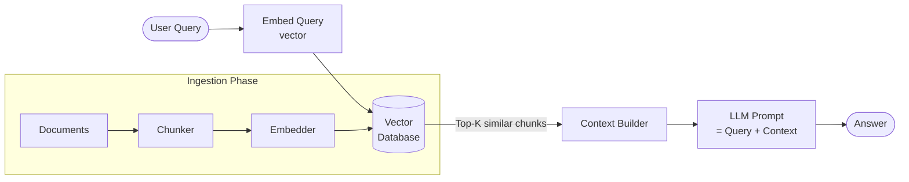

### Core Components

| Component | Role | Example Tools |
|-----------|------|---------------|
| **Chunker** | Splits documents into manageable pieces | LangChain, Docling |
| **Embedder** | Converts text chunks to dense vectors | `text-embedding-3-large`, BGE |
| **Vector DB** | Stores and retrieves vectors by similarity | Qdrant, Weaviate, Pinecone |
| **LLM** | Generates the final answer from context | Claude, GPT-4o |

### Limitations of Naive RAG

- Splitting documents naively **shreds table context** (a torque value without its column header is meaningless)
- Pure semantic search **misses exact tokens** like part IDs (`M8-bolt-2025`)
- No image understanding — PDFs with blueprints are treated as blind spots
- No guaranteed citation → hallucination risk

---

## 2. Hybrid RAG

**Hybrid RAG** addresses the retrieval gap by combining two fundamentally different search strategies.

### The Problem with Pure Semantic Search

Semantic search finds *conceptually similar* content. But in engineering:

> `"47 Nm torque"` and `"74 Nm torque"` are semantically similar — they are safety-critically different.

> `"M8-bolt-2025"` must be found by exact token match, not by cosine similarity to "fastener".

### Hybrid = Dense + Sparse

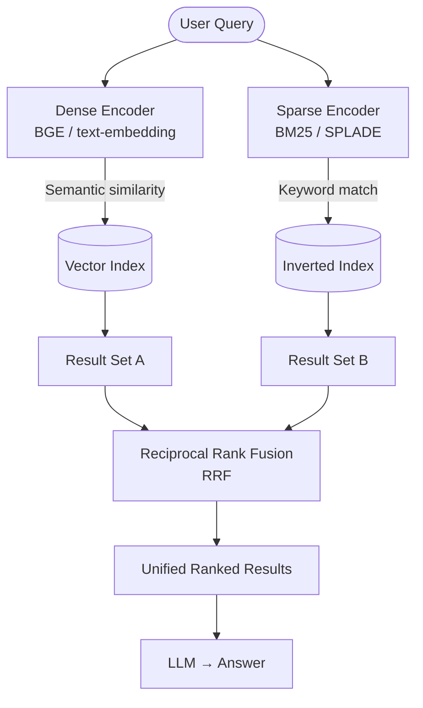

### Reciprocal Rank Fusion (RRF)

RRF merges two ranked lists without needing to normalize scores:

```
RRF_score(doc) = Σ  1 / (k + rank_in_list_i)
```

- `k = 60` is a common default
- A document ranked #1 in both lists scores higher than one ranked #1 in only one list
- Safe to combine lists from systems with incompatible score scales

### When to use each retriever

| Query Type | Best Retriever | Example |
|------------|---------------|---------|
| Conceptual question | Dense (semantic) | "How does the rear subframe absorb crash energy?" |
| Exact part lookup | Sparse (BM25) | "Find specs for M8-bolt-2025" |
| Numeric spec | Structured DB (SQL) | "What is the torque for bolt A17 at node 4?" |
| Mixed intent | Hybrid (both) | "What bolts does the firewall assembly use and what are their torque values?" |

---

## 3. Full Multimodal RAG

**Full Multimodal RAG** extends the pipeline to handle non-text modalities natively — images, diagrams, blueprints — as first-class retrieval targets.

### Why text-only RAG fails for automotive

- Assembly blueprints are 2D spatial diagrams. Their meaning cannot be captured as text.
- A mechanic uploading a photo of a cracked frame needs to match that image against the structural manual — not a text description of the frame.
- Tables in PDFs, when OCR'd naively, lose spatial relationships between cells and headers.

### Architecture: Caption-Augmented vs. Native Multimodal

#### Approach A — Caption-Augmented (simpler, weaker)

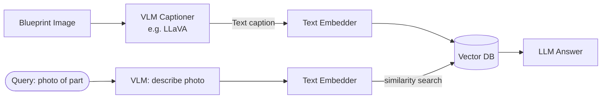

**Weakness:** The caption is a lossy compression of the image. If the caption misses a dimension label, that data is gone forever.

#### Approach B — Native Multimodal Embeddings (stronger)

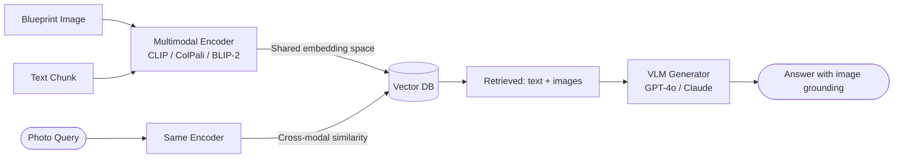

**Strength:** A photo query directly retrieves diagrams in the same embedding space. No caption intermediary.

### Key Models for Native Multimodal Embedding

| Model | Strength | Best For |
|-------|----------|---------|
| **ColPali** | Late interaction on page images | PDF-native retrieval without OCR |
| **CLIP / SigLIP** | Image-text alignment | Cross-modal search |
| **BLIP-2** | Image captioning + VQA | Visual QA on diagrams |
| **GPT-4o / Claude** | Generation from mixed context | Final answer synthesis |

---

## 4. Hybrid Multimodal RAG

**Hybrid Multimodal RAG** is the synthesis of all the above: it combines dense + sparse retrieval with multimodal embeddings, structured data stores for exact numerics, and a routing layer that directs each query to the correct retrieval path.

This is the architecture that makes sense for high-stakes engineering domains.

### Why the combination is necessary

No single retrieval strategy handles all automotive query types:

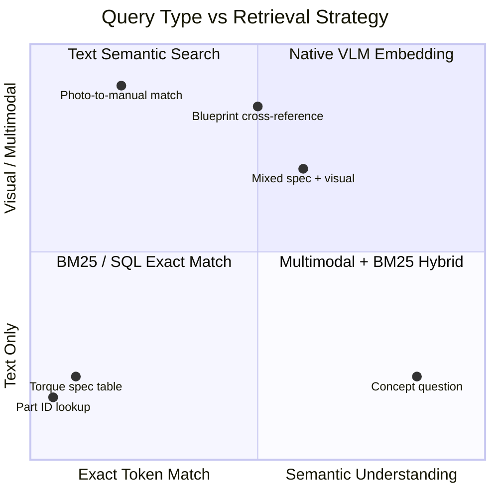

### Full Hybrid Multimodal RAG Architecture

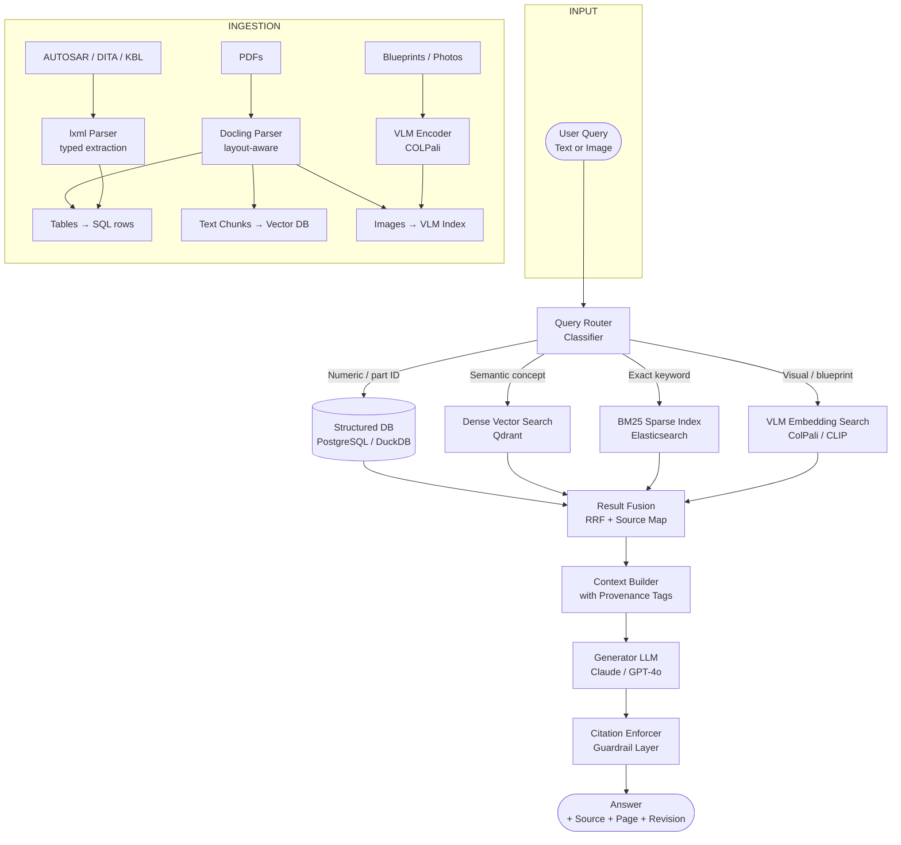

---

## 5. Recommended Architecture for This Project

### System Design Principles

Given the automotive safety context (ISO 26262, IATF 16949), three principles are non-negotiable:

1. **Numerics are never retrieved by similarity** — exact match from typed storage only
2. **Every answer carries a verifiable source trail** — document, page, section, revision hash
3. **The LLM is a formatter, not an oracle** — it assembles retrieved facts, never infers specs

### Component Stack

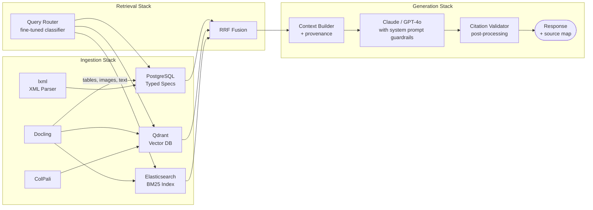

### Technology Choices Explained

| Layer | Tool | Why |
|-------|------|-----|
| PDF parsing | **Docling** | Preserves table structure as DataFrames, handles multi-column layouts, outputs image bounding boxes |
| XML parsing | **lxml** | Full XPath support, schema validation, parent-child traversal for AUTOSAR/DITA |
| Vector DB | **Qdrant** | Native sparse+dense hybrid search in one system, payload filtering for metadata |
| Sparse index | **Elasticsearch BM25** | Industry standard for exact token retrieval, integrates with Qdrant via federation |
| Structured DB | **PostgreSQL** | Typed columns for torque specs, part IDs, tolerances; ACID compliance for safety traceability |
| Multimodal embed | **ColPali** | Embeds full PDF pages as images — no OCR pipeline needed, preserves spatial layout |
| LLM Generator | **Claude 3.5 Sonnet** | Long context window, strong instruction following for citation constraints |
| Orchestration | **LangGraph** | Stateful agent graph, supports conditional routing between retrieval paths |

### Query Router Logic

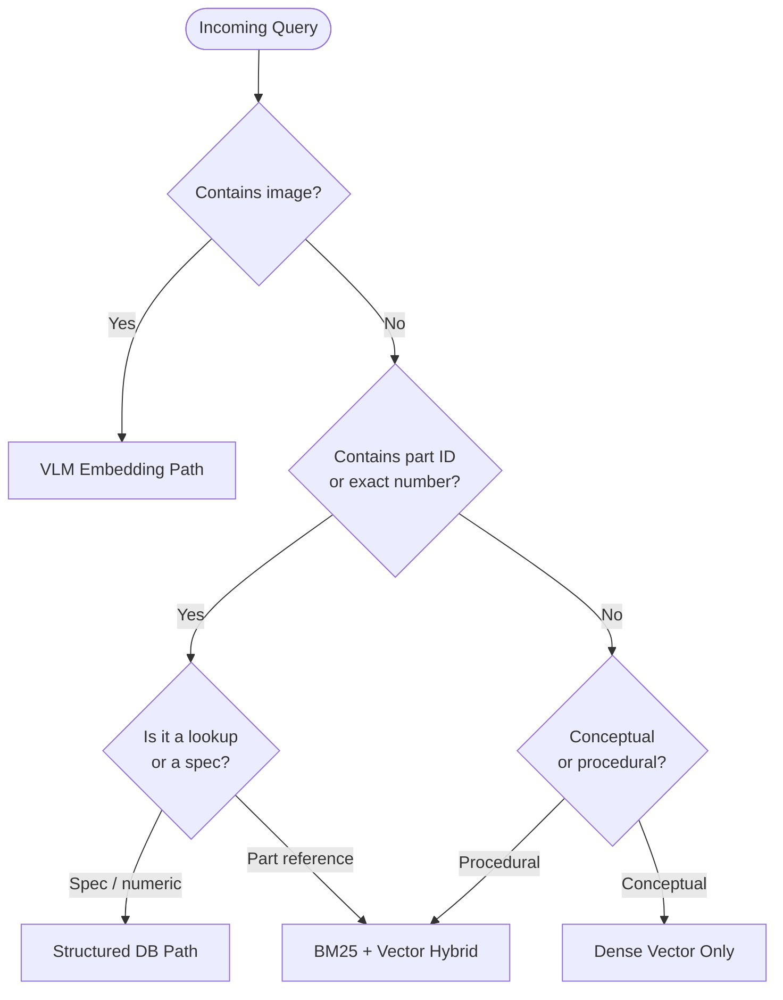

### Citation & Guardrail Pattern

Every chunk in the vector DB and every row in the structured DB must carry a provenance payload:

```json
{
  "doc_id": "chassis-assembly-v4.2",
  "revision_hash": "sha256:a3f9c...",
  "page": 47,
  "section": "3.4.2",
  "table_id": "T-14",
  "row": 3,
  "col": "Torque (Nm)",
  "extraction_method": "docling-table",
  "extracted_at": "2025-04-01T09:00:00Z"
}
```

The system prompt enforces citation at generation time:

```
You are a structural engineering assistant. You MUST:
1. Answer ONLY using the retrieved context provided below.
2. End every numeric claim with [Source: {doc_id}, Page {page}, Section {section}].
3. If the retrieved context does not contain the answer, respond:
   "This specification was not found in the retrieved documents. 
    Please consult [doc_id] directly or contact the responsible engineer."
4. NEVER estimate, interpolate, or infer numeric values.
```

---

## 6. Project Roadmap

### Overview Timeline

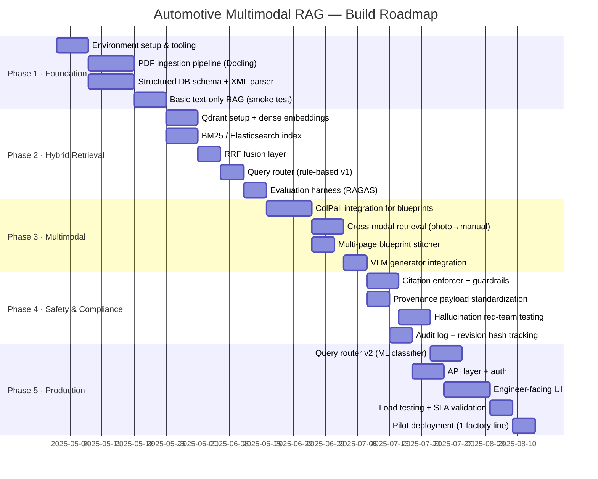

### Phase Breakdown

#### Phase 1 — Foundation (Weeks 1–3)

**Goal:** Reliable ingestion of PDFs and XML without data loss.

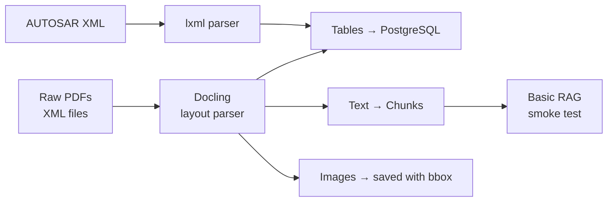

Key deliverables:
- `AutomotivePart` data class with typed spec fields
- Table-to-SQL pipeline preserving column headers
- Chunk metadata schema with page + section provenance
- First end-to-end query returning a torque value with source citation

---

#### Phase 2 — Hybrid Retrieval (Weeks 4–6)

**Goal:** Part ID lookup precision + semantic coverage working together.

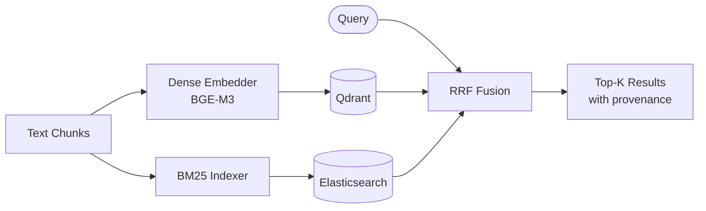

Key deliverables:
- Qdrant collection with payload metadata
- BM25 index with field boosting on part IDs
- RRF merger returning unified ranked list
- RAGAS evaluation baseline (context precision, recall, answer faithfulness)

---

#### Phase 3 — Multimodal (Weeks 7–9)

**Goal:** Blueprint retrieval from image queries; visual context in answers.

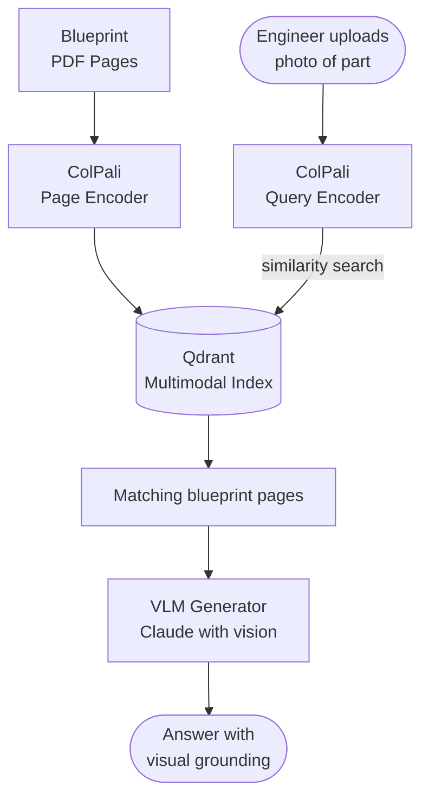

Key deliverables:
- ColPali-indexed blueprint library
- Multi-page stitcher for fold-out diagrams
- Cross-modal query path (image input → text + image output)
- VLM prompt template with citation enforcement for visual sources

---

#### Phase 4 — Safety & Compliance (Weeks 10–11)

**Goal:** Zero-hallucination guarantee on numeric specs; audit-ready output.

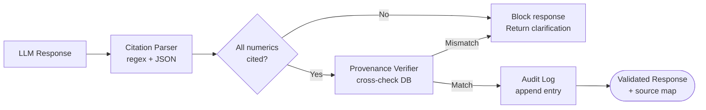

Key deliverables:
- Citation enforcer post-processing layer
- Revision hash tracking for every source document
- Red-team test suite: numeric swap attacks, hallucination probes
- Audit log schema compatible with ISO 26262 traceability requirements

---

#### Phase 5 — Production (Weeks 12–16)

**Goal:** Factory-floor deployment with engineer-facing UI and SLA compliance.

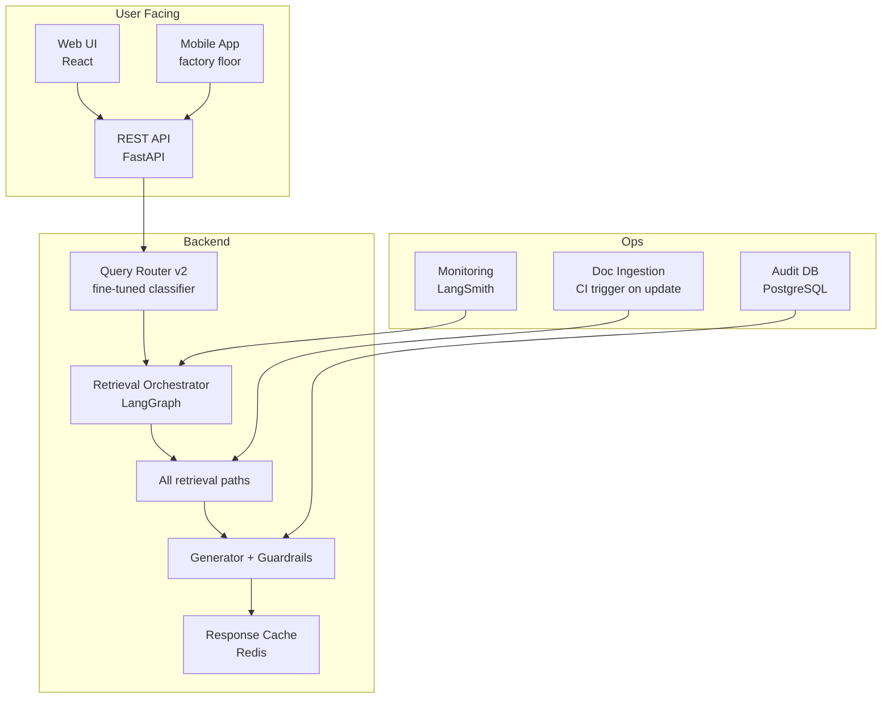

Key deliverables:
- FastAPI service with auth and rate limiting
- LangGraph-orchestrated agent with stateful routing
- LangSmith tracing for every query (compliance requirement)
- Pilot on one production line with 20 engineers

---

### Success Metrics by Phase

| Phase | Metric | Target |
|-------|--------|--------|
| 1 | Table extraction fidelity | > 99% rows correctly parsed |
| 2 | Part ID retrieval precision@5 | > 0.95 |
| 2 | Semantic recall@10 | > 0.85 |
| 3 | Blueprint retrieval MRR | > 0.80 |
| 4 | Numeric hallucination rate | 0% on test suite |
| 4 | Citation completeness | 100% of numeric claims cited |
| 5 | P95 query latency | < 3 seconds |
| 5 | Engineer satisfaction (pilot) | > 4.2 / 5.0 |

---

## Appendix: Key Risks & Mitigations

| Risk | Impact | Mitigation |
|------|--------|-----------|
| Table split across PDF pages | Missing torque rows | Docling continuation detection + table ID stitching |
| VLM embeds semantics not magnitudes | Wrong numeric retrieval | Separate structured DB; numerics never embedded |
| Outdated document version in index | Wrong spec served | Revision hash in provenance; ingestion CI on document update |
| Multi-column PDF layout shredded | Context loss | Docling `do_table_structure=True` + layout-aware chunking |
| Cross-modal query hits wrong part family | Wrong blueprint returned | Re-ranker with part family filter as Qdrant payload condition |
| LLM infers beyond retrieved context | Hallucination | System prompt hard constraints + post-generation citation check |

---

*Document version: 1.0 — April 2025*
*Architecture: Hybrid Multimodal RAG for Automotive Structural Engineering*
